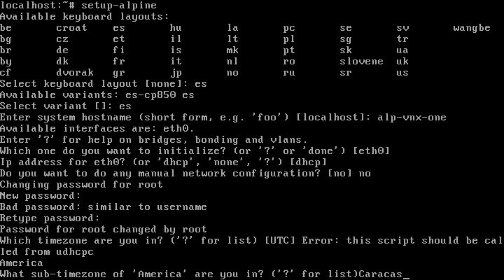
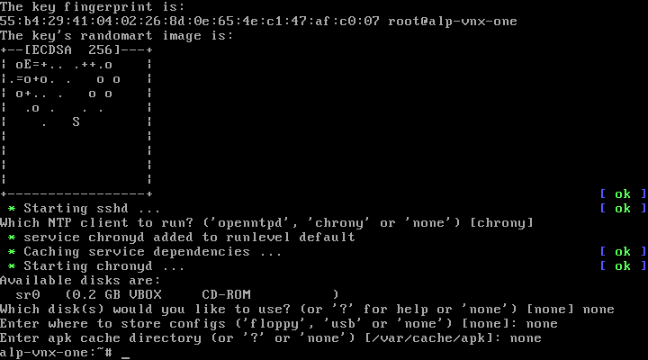
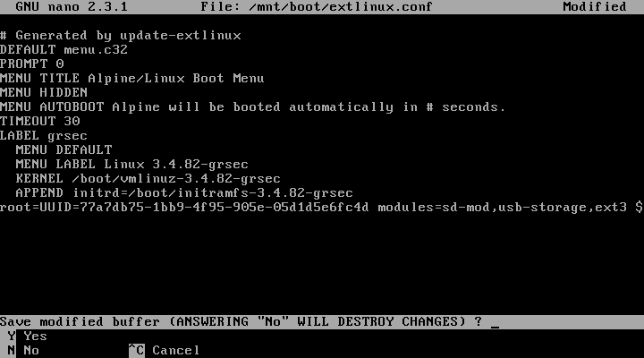

Este documento guiara para instalar Alpine optimizado y usando dual boot, pero 
el gestor de arranque sera comandado desde el otro sistema que asumiremos Linux y con Grub.
Debe descargar un ISO de Alpine version "extended" recomendable para internet lento.

Si no posee un USBdrive puede grabar el archivo ISO en un CD o DVD, si no posee ninguno 
lease: [instalar-desde-virtualbox-a-discoreal-dualboot-guia.md](instalar-desde-virtualbox-a-discoreal-dualboot-guia.md)


## Preparar medios para instalar

Alpine desde la version 3.4 es "isohybrid" lo que significa que puede hacer facil un USB arrancable 
simplemente copiando su contenido en el dispositivo entero, para ello debe identificar el 
dispositivo usando `blkid` y despues asumiendo el USB es "sde" se realiza el comando:

```
cp alpine-extended-3.8.2-x86.iso /dev/sde
```

**IMPORTANTE** aqui se identifico el disco USB como `/dev/sde` esto se identifica con `blkid` .

Despues hacemos que arranque la maquina el disco USB en vez del disco duro, y arrancara el linux.
Al iniciar Alpine preguntara pro el login, solo escribir `root` y pulsar enter permite iniciar:


## Configurar disco en donde instalar

A diferencia de otros sistemas de instalacion, el de alpine es automatico en el disco, 
y monta un viaje de particiones innecesarias, para hacer una configuracion manual 
hay que ejecutar `fdisk`, particionar, y despues montarlo para `setup-disk` y alli indicar.

#### 1. Particionar

Se advierte dejar la estupidez de particionamiento complicado, no hay ninguna necesidad 
de separar boot y demas, solamente home, porque se supone el linux es perfecto y no se jode!
En debian desde que uso squeeze no separo para mis desktop solo en servidores.
La separacion era solo porque a medida se instalaba o necesitaba espacio no se 
podia apagar la maquina y de paso los discos eran lentos y pequeños... 
por ello existia las particiones y el LVM, cosa que hoy es innecesria en desktop..

**IMPORTANTE** colocar LVM hace mas lento, se aprecia cuando trabajas con java y eclipse 
y las maquinas sin LVM son EVIDENTEMENTE mas rapidas. Otra forma de evidenciarlo 
es usando un disco SSD, porque son mas rapidos, obvio el acceso es mas rapido.. 
pienselo, LVM es una capa mas sobre las ya capas de manejo de sistema de ficheros...

El disco se le borrara toda particion, si queire usar dualboot (WIP guia dual boot)
secuencia de comandos OJO ESTAMOS USANDO MBR, para GPT es distinto, usaremos MBR, porque 
ahorra unos microsegundos, esto porque la GPT tiene dos capas, la que ve el OS y 
una extra que emula la MBR para que los OS viejos vean una sola particion que 
indique que es del tipo GPT, esta capa de compatibilidad es tiempo muerto, asi 
que usaremos MBR con solo particiones primarias, las extendidas tienen el mismo 
defecto ya que necesitan un indice extra para indicar cuantas extendidas hay:

* Ejecutar `fdisk /dev/sda`
* Pulsar `d` al pedir numero pulsar `4` y borrara la particion 4.
* Pulsar `d` al pedir numero pulsar `3` y borrara la particion 3.
* Pulsar `d` al pedir numero pulsar `2` y borrara la particion 2.
* Pulsar `d` al pedir numero pulsar `1` y borrara la particion 1.
* Pulsar `n` y al preguntar entre "e" y "p" pulsar `p` siempre usar primaria
* Preguntara numero particion pulsar `1` que sera la root
* Preguntara "First cilinder" usar `2` no usar 1. En Last cilinder usar el tamaño asi: `+20G` para gigas
* Pulsar `n` y al preguntar entre "e" y "p" pulsar `p` siempre usar primaria
* Preguntara numero particion pulsar `2` que sera la root
* Preguntara "First cilinder" usar `Enter` sin ingresar nada. En Last cilinder usar el tamaño asi: `+2G` para swap
* Pulsar `n` y al preguntar entre "e" y "p" pulsar `p` siempre usar primaria
* Preguntara numero particion pulsar `3` que sera la home
* Preguntara "First cilinder" usar `Enter` sin ingresar nada. En Last cilinder usar el ultimo numero menos uno!

**NOTA1: swap** no usar una swap de mas de 2G es ilogico.. leer documentacion redhat y diseño del kernel.
**NOTA2: home** no usar nunca el primer o ultimo cilindro en discos, esto causa perdida de datos en desmonturas forzadas (ida de luz)
**NOTA3** en las laptops es mas que innecesario una swap grande o LVM ya que las pone mas lentas.

El mapa de disco quedara asi par mi caso de 320G :

```
Device     Boot    Start       End   Sectors   Size Id Type
/dev/sdb1  *          63  41945714  41945652    20G 83 Linux
/dev/sdb2       41947136  46141439   4194304     2G 83 Linux
/dev/sdb3       46141440 625142447 579001008 276,1G 83 Linux
```

#### 2. Configurar disco

Una vez particionado debemos preconfigurar el `setup-disk` con el 
destino que se usara. Para esto formateamos, montamos y ejecutamos indicacion:

```
apk add e2fsprogs
mkfs.ext3 /dev/sda1 -L alp1root -b 2048
mount -t ext3 /dev/sda1 /mnt
```

Esto dejara el disco alli pendiente, el instalador le indicaremos no usarlo para despues, reconfigurar que se usara.

**IMPORTANTE** ya que usaremos archivos pequenos mas que grandes, la raiz usara "2048" 
en vez de "4096" permitiendo mas fragmentacion y asi encontrando mas rapido la escritura. 
En el caso de la particion home esta si dejarla con 4096 ya que alli ud guardara su ~porn~ digo peliculas, 
Esto es porque alocar un bloque grande para un archivo pequeño hace que las busquedas sean lentas, 
el sistema operativo tiene muchos archivos pequeños asi que por eso usar un tamaño de bloque pequeño.

# Instalar el sistema 

Alpine usa una version cortada de Libc llamda `musl` desde la 3.X, en 
las versiones viejas usaba `uClibc` ambas siempre ponen el teclado a ingles, 
asi que cuidado con lo que escribe esto no es winbuntu, esto es linux okey:

**ADVERTENCIAS** la cagada como todas las minimalistas es que se requiere internet, 
a menos tengas una imagen ya instalada y simplemente la clones en el disco. 
asi que **necesitas insternet si es primera vez o no tienes imagen alpine**.

**IMPORTANTE** debes cuando llegue a la parte del disco "Which disks yous you like to use?" 
contestar "none",de alli en adelante contestar "none" hasta salir, esto para permitir 
la configuracion customizada de disco.


```
setup-alpine
```

No usar ningun flag, solo el comando, despues de contestar "none" a las preguntas sobre el 
disco, ejecutar el configurador del disco para colocar lso archivos en el disco:

```
setup-disk -m sys /mnt
```

Esto copiara el sistema al disco pero recordemos tenemos el sistema en una sola particion 
y alpine es marico con eso, asi que hay que ajustarlo en el bootmanager config asi:

```
apk add nano
nano /mnt/boot/extlinux.conf
```

A los parametros `KERNEL` y `APPEND` hay que indicar es desde el directorio `/boot/` 
del disco iniciado adicionando en "KERNEL y agregando en "APPEND" en el parametro "initrd".
En las imagenes se muestra todos estos, usar como referencia.








# Vease tambien:

* [README informacion general](../README.md)
* [instalar-desde-virtualbox-a-discoreal-dualboot-guia.md](instalar-desde-virtualbox-a-discoreal-dualboot-guia.md)
* [Entorno grafico](../programas/README-escritorios.md)
* [Instalacion de programas](../programas/README.md)
* [Informes y tablas de compatibilidad](../informes/hardware-y-versiones-alpine-recomendados.md)
