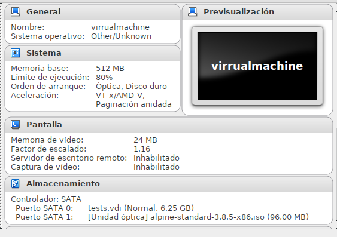
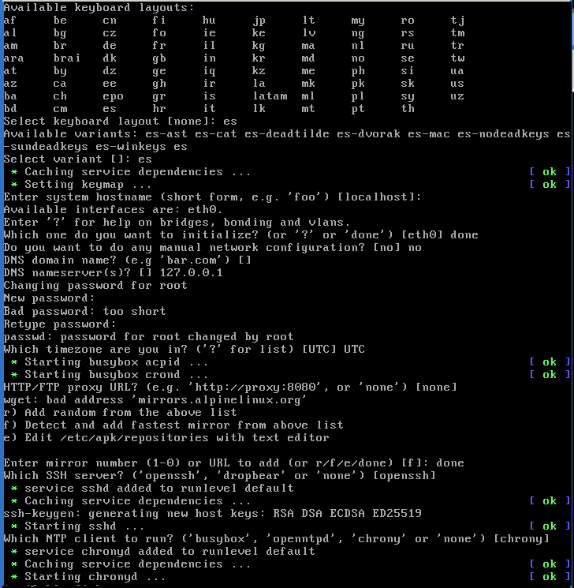

Este documento guiara para **instalar Alpine como unico systema en el disco**, 
y particionara automaticamente el disco colocando solo Alpine Linux y con Grub.
Debe descargar un ISO de Alpine version "extended" recomendable para internet lento.

Esto sirve si no se tiene un USBdisc o CDrom vacios, entonces usaremos virtualbox, 
la instalacion sera automatizada, creara unas particiones automaticamente, si puede 
usar USB lease: [instalar-desde-usb-a-discoreal-alpinesolo-computadora.md](instalar-desde-usb-a-discoreal-alpinesolo-computadora.md) o 
usar CD/DVD lea: [instalar-desde-cdrom-a-discoreal-alpinesolo-computadora.md](instalar-desde-cdrom-a-discoreal-alpinesolo-computadora.md).

## preparar medios para instalar

**Monte el disco real como esclavo en la pc**, si usa laptop necesitara una bahia de disco externo.
Para esto creamos una unidad que mapee el disco real como virtual y despues crear 
una maquina virtualbox que lo utilize, desde virtualbox:

```
VBoxManage internalcommands createrawvmdk -rawdisk /dev/sdb -filename /home/systemas/VirtualBox\ VMs/rawdisk-sdb.vmdk
```

**NOTA:** el instalador de alpine automatiza la creacion de particiones,
generalmente el 70% es la raiz y 100M en el boot, swap nunca pasa de 4 gigas.

Despues configuramos una maquina virtual, y arrancamos con ese disco, 
es decir se le debe configurar la maquina virtual para que arranque el iso 
descargado de Alpine linux en el segundo dispositivo de media storage.
Para que arranque desde este medio se le pulsa `F12` en la pantalla apenas 
enciende o inicia la maquina virtual desde el virtualbox.
 


Al iniciar Alpine preguntara por el login, solo escribir `root` y pulsar enter permite iniciar:


## Configurar disco en donde instalar

A diferencia de otros sistemas de instalacion, el de alpine es automatico en el disco, 
y monta varias de particiones segun el caso, como en este documento el 
procedimiento es automatico, se crearan por el instalador como minimo cuatro 
y estas se configuraran segun la necesidad, si es UEFI o BIOS, dado es una 
maquina virtualizada comunmente se asumira BIOS.

**IMPORTANTE** El disco se asumira sera usado completamente ya que alpine estara solo, 
no sera necesario particionar ni formatear porque el instalador lo hara. 
Se asume un disco de minimo 4 gigas donde swap sera de 2 gigas en tamaños.

# Instalacion

Alpine usa una version cortada de Libc llamda `musl` desde la 3.X, en 
las versiones viejas usaba `uClibc` ambas siempre ponen el teclado a inglesh, 
asi que cuidado con lo que escribe esto no es winbuntu, esto es linux.

La manera de instalar alpine es simple y unica, un solo script realiza 
todas las tareas el `setup-alpine` este desde alpine v3.10 soporta perfectamente 
todos los tipos sea UEFI o BIOS, el cual sera `grub` o `isolinux` respectivamente. 

**ADVERTENCIAS** dado el minimalismo, lamentablemente se requiere internet, 
a menos tengas una imagen ya instalada y simplemente la clones en el disco. 
asi que **necesitas internet si es primera vez o no tienes imagen alpine**.

## Instalar el sistema base

Despues de entrar al arrancar la media de instalacion se realiza estos comandos:

```
export BOOT_SIZE=500
export SWAP_SIZE=2048
export BOOTLOADER=grub

setup-alpine
```

Esto comenzara unas preguntas, estas son en el siguiente orden:
* teclado y variante, ejemplo para latino es `es` y depues `es-winkeys`
* hostname: solo presione enter, es el nombre de la computadora.
* Opciones de red: seleccione el `eth0` que es el cable de red y contestar `dhcp`.
* Opciones de DNS: se recomienda usar `8.8.8.8` y `none` para el dominio
* Opciones de zona horaria: solo use los valores predeterminados sugeridos.
* Opciones de proxy: use `none` si se conecta directamente a Internet.
* Opciones de SSH: use `openssh` el paquete que ya viene en el medio.
* Opciones de NTP: use `chrony` el paquete que ya viene en el medio.
* Modo: seleccione "sys" para instalar el sistema en el disco.
* Opciones de disco: use "sda" ya que se usara todo el disco duro presente.

Despues de contestar "sys" a las preguntas sobre el 
disco, y como solo existira un solo disco contestar "sda" en que disco usar,
esto creara y dejara su disco duro de la siguiente manera:

* `/dev/sda1` como BOOT en 500Mb en `/boot`
* `/dev/sda2` como SWAP en 4Gb
* `/dev/sda3` como ROOT en 200Gb en `/` (aproximadamente)

En pocos minutos estara ya todo listo para usar, 
lo siguiente es [despues de instalar: configuracion y paquetes](../recetas/alpine-recetas-configuracion-y-paquetes-sistema.md)



# Aclaratorias y deficiencias

1. **El boot manager es syslinux** aqui se customizo a grub, dado que, syslinux es mas 
rapido pero solo Grub soporta bien UEFI, puesto en cada modificacion debe volver escribirse el MBR. 
Cabe destacar que para dual boot es recomendable usar el directorio `/etc/update-extlinux.d/` 
mediante la colocacion de archivos ".conf" se puede usar numeros para ello, la sintaxis debe 
ser igual que la de syslinux para entradas, en nuestros documentos no apoyaremos syslinux 
por ser demasiado delicado y exigir escribir en el MBR en cada cambio.
2. **Para EFI en versiones viejas anteriores a la 3.9 se debe cambiar el bootmanager**, si puede 
no se recomienda usar EFI/UEFI y desactivelo, desde Alpine 3.9.2 ya esto es automatico, 
lamentablemente como toda distro minimalista su spoporte UEFI es cortado y deficiente, 
desactive el UEFI y mejor use particionamiente MBR en vez de GPT para evitar problemas. 
Hoy dia el instalador utiliza grub si necesita emplear soporte UEFI pero deben existir las particiones.

# Vease tambien:

* [README varios tipos de instalacion](README.md)
* [Receta despues de instalar: configuracion y paquetes](../recetas/alpine-recetas-configuracion-y-paquetes-sistema.md)
* [instalar-desde-imagen-a-virtualbox-alpinesolo-computadora.md](instalar-desde-imagen-a-virtualbox-alpinesolo-computadora.md)
* [instalar-desde-usb-a-discoreal-alpinesolo-computadora.md](instalar-desde-usb-a-discoreal-alpinesolo-computadora.md) 
* [instalar-desde-cdrom-a-discoreal-alpinesolo-computadora.md](instalar-desde-cdrom-a-discoreal-alpinesolo-computadora.md).
* [instalar-desde-virtualbox-a-discoreal-dualboot-guia.md](instalar-desde-virtualbox-a-discoreal-dualboot-guia.md)
